# 🖥️ Linux Infrastructure Monitoring Stack

> A comprehensive infrastructure monitoring project built with **Bash scripting**, **Prometheus**, **Grafana**, and **Node Exporter** — designed to demonstrate practical Linux Administration and Cloud Support Engineering skills.

[](https://ubuntu.com)
[](https://www.gnu.org/software/bash/)
[](https://prometheus.io)
[](https://grafana.com)
[](https://www.docker.com)

---

## 👋 About This Project

I built this project as a **fresher Linux Admin and Cloud Support Engineer** to demonstrate hands-on skills across:

- **Linux system administration** — monitoring CPU, memory, disk, network, and processes
- **Shell scripting** — 14 production-quality Bash scripts with error handling, color output, and logging
- **Observability** — Prometheus + Grafana + Node Exporter metrics stack
- **Security** — user auditing, SSH failure detection, sudo access review
- **Operations** — backup automation with rotation, log scanning, service health checks
- **Documentation** — setup guides, concept explanations, and troubleshooting runbooks

---

## 📁 Repository Structure

```
monitoring-stack/
│
├── scripts/                  # 14 Bash monitoring scripts
│   ├── system-info.sh        # Full OS/hardware/network summary
│   ├── health-report.sh      # Infrastructure dashboard
│   ├── alert-check.sh        # Threshold-based alerting + logging
│   ├── cpu-monitor.sh        # CPU usage, cores, load avg, per-core
│   ├── memory-monitor.sh     # RAM, swap, OOM detection, pressure
│   ├── disk-monitor.sh       # Filesystems, inodes, I/O, large files
│   ├── network-monitor.sh    # Interfaces, ports, DNS, connectivity
│   ├── process-monitor.sh    # Top procs, zombies, per-user stats
│   ├── service-monitor.sh    # systemd services across 4 categories
│   ├── uptime-monitor.sh     # Uptime, load classification, reboots
│   ├── log-monitor.sh        # syslog errors, OOM, auth failures
│   ├── user-audit.sh         # Users, sudo, SSH keys, login audit
│   ├── backup.sh             # tar.gz backup with rotation
│   └── docker-monitor.sh     # Containers, images, volumes, networks
│
├── prometheus/               # Prometheus configuration + alert rules
├── grafana/                  # Grafana dashboard provisioning
├── node-exporter/            # Node Exporter setup
├── docker/                   # Docker Compose for full stack
│
├── docs/                     # Documentation
│   ├── setup-guide.md        # Installation and usage guide
│   ├── monitoring-concepts.md # CPU/memory/disk/network concepts
│   ├── troubleshooting.md    # Real-world issue resolution guide
│   └── scripts-reference.md  # Full reference for all 14 scripts
│
├── screenshots/              # Script output screenshots
├── logs/                     # Alert log output (auto-created)
└── backups/                  # Backup storage (auto-created)
```

---

## 🚀 Quick Start

```bash
# Clone the repository
git clone https://github.com/lnvpatel/monitoring-stack.git
cd monitoring-stack

# Make all scripts executable
chmod +x scripts/*.sh

# Run a full system overview
./scripts/system-info.sh

# Run the infrastructure health dashboard
./scripts/health-report.sh

# Run threshold-based alerting
./scripts/alert-check.sh
```

---

## 🔧 Scripts Overview

| Script | What It Does |
|---|---|
| `system-info.sh` | OS, kernel, CPU, RAM, disk, network, Docker, cloud detection |
| `health-report.sh` | One-stop infrastructure dashboard with status for all components |
| `alert-check.sh` | CPU / memory / swap / disk threshold alerts with color + log file |
| `cpu-monitor.sh` | CPU model, cores, real-time usage, per-core stats, load classification |
| `memory-monitor.sh` | RAM, swap, OOM killer detection, memory pressure indicators |
| `disk-monitor.sh` | Filesystem usage, inode stats, disk I/O, large file detection |
| `network-monitor.sh` | Interface states, routing, DNS, ping tests, listening ports |
| `process-monitor.sh` | Top CPU/mem processes, zombie detection, per-user breakdown |
| `service-monitor.sh` | 18 services in 4 groups: Core OS, Security, Web/App, DevOps |
| `uptime-monitor.sh` | Uptime (d/h/m/s), load classification, reboot history, cron jobs |
| `log-monitor.sh` | syslog errors, OOM events, SSH brute force, journald, dmesg |
| `user-audit.sh` | Users, sudo access, empty passwords, SSH keys, failed logins |
| `backup.sh` | Compressed tar.gz backup with integrity check and auto-rotation |
| `docker-monitor.sh` | Container stats, images, volumes, networks, system disk usage |

---

## 📸 Script Output Screenshots

### `system-info.sh` — System Overview
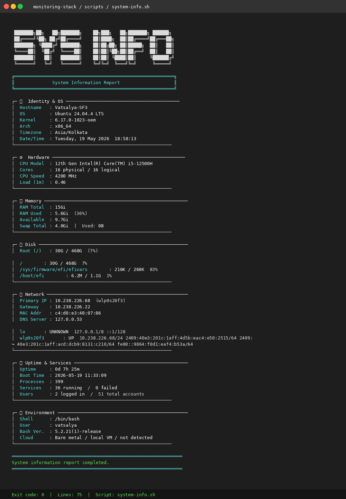

### `health-report.sh` — Infrastructure Dashboard
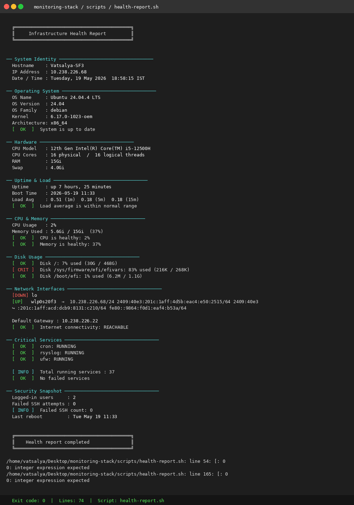

### `alert-check.sh` — Threshold Alerts
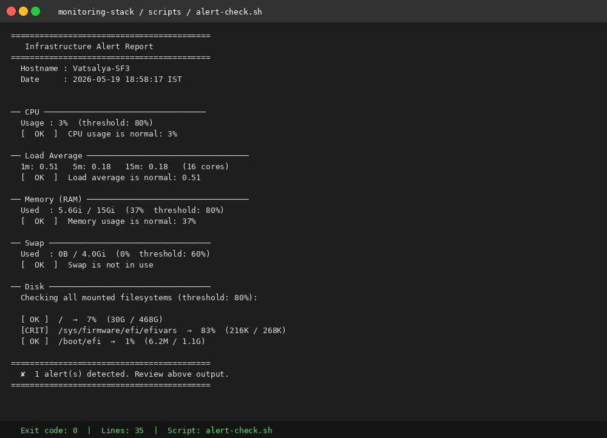

### `cpu-monitor.sh` — CPU Details
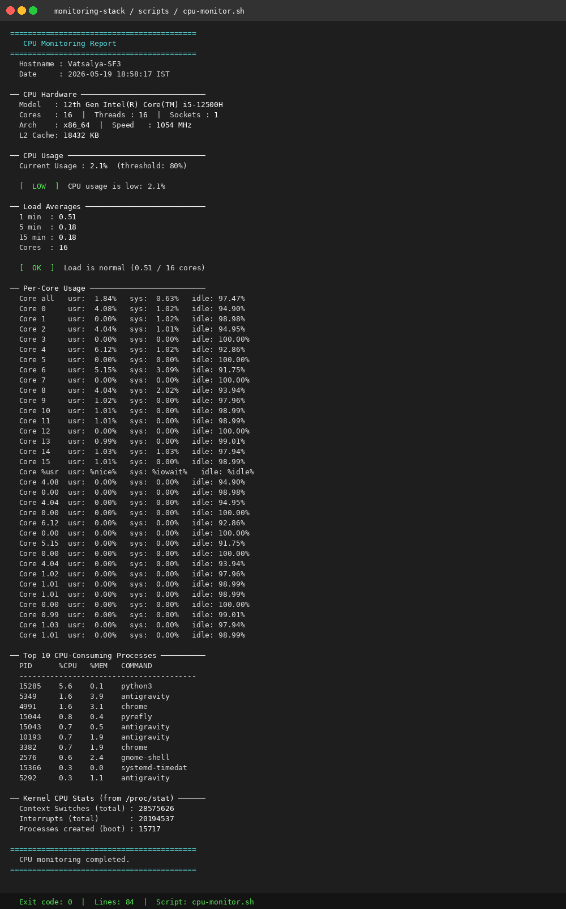

### `memory-monitor.sh` — Memory & Swap
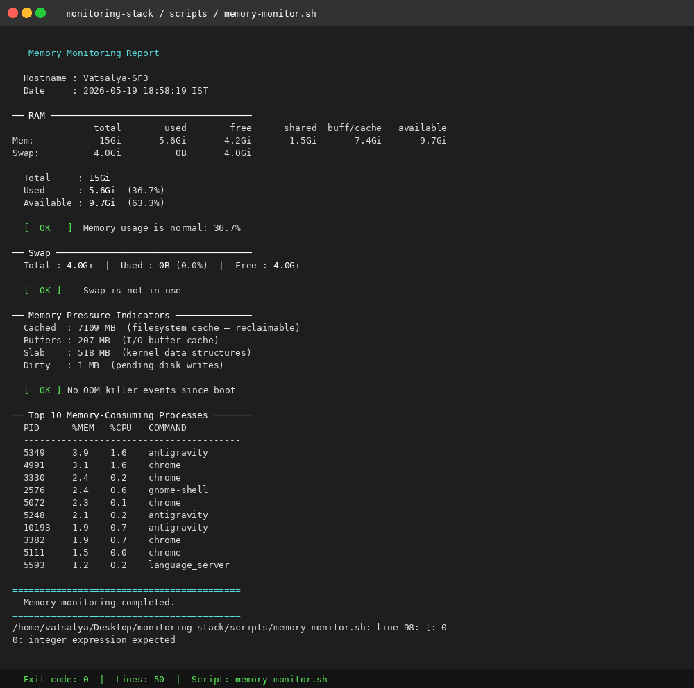

### `disk-monitor.sh` — Disk Usage
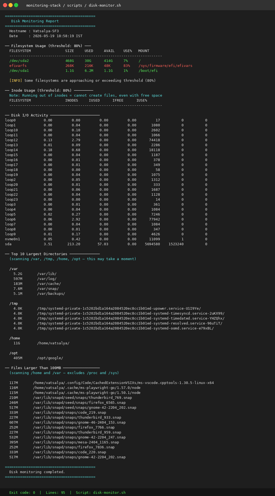

### `network-monitor.sh` — Network Status
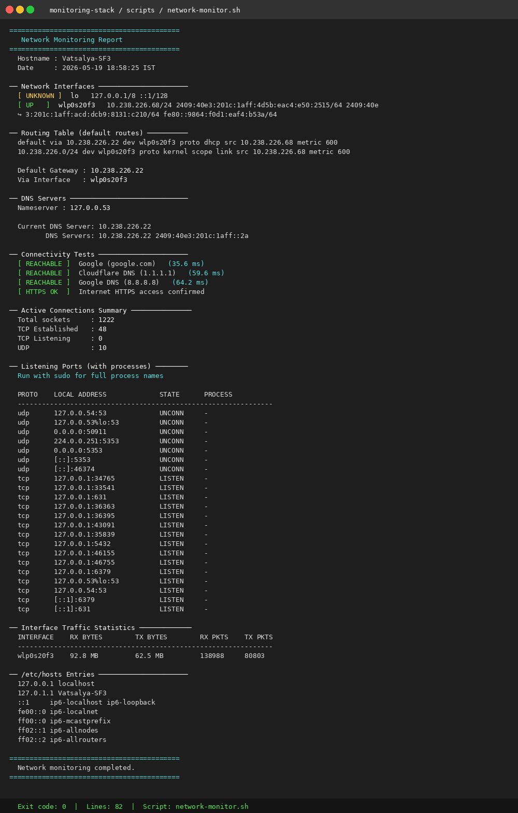

### `process-monitor.sh` — Process Analysis
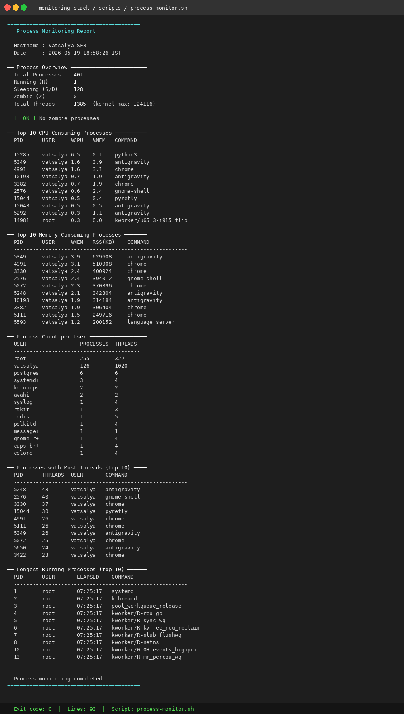

### `service-monitor.sh` — Service Health
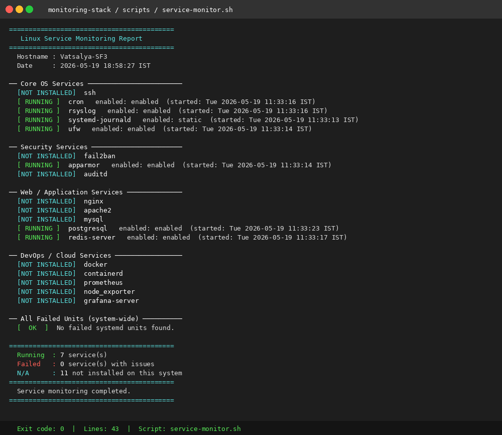

### `uptime-monitor.sh` — System Uptime
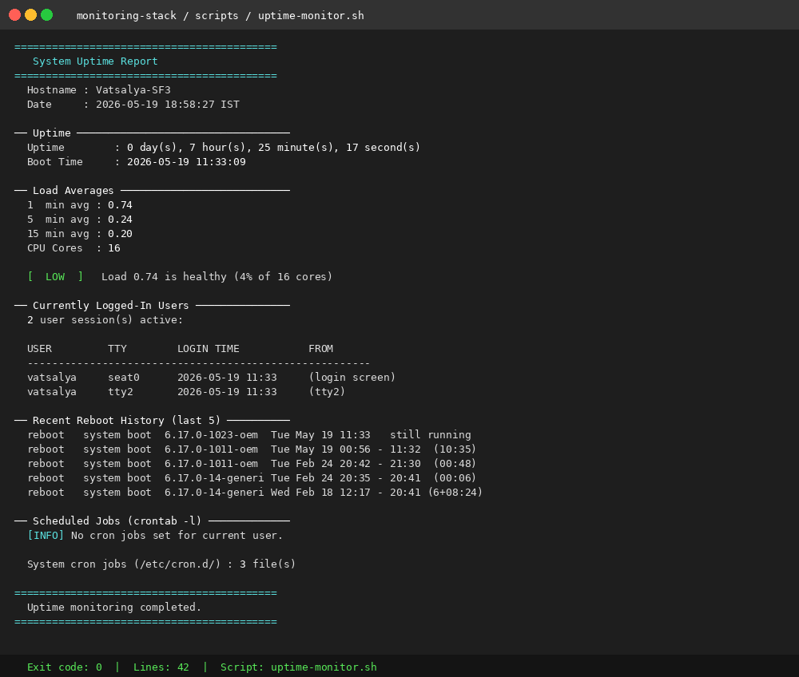

### `log-monitor.sh` — Log Scanning
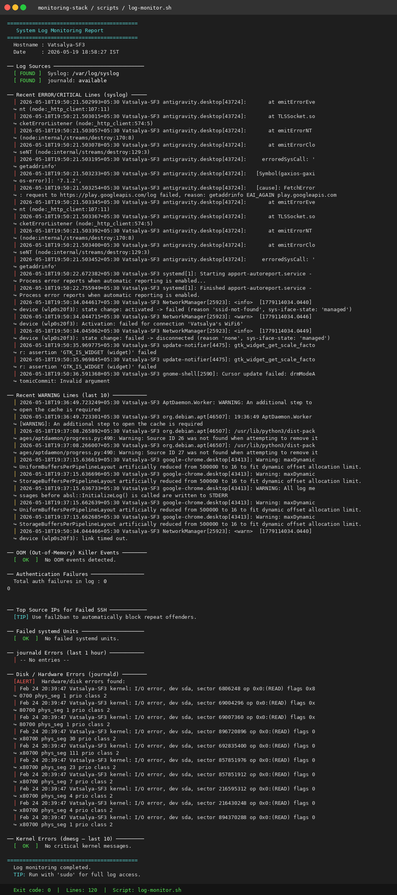

### `user-audit.sh` — User Security Audit
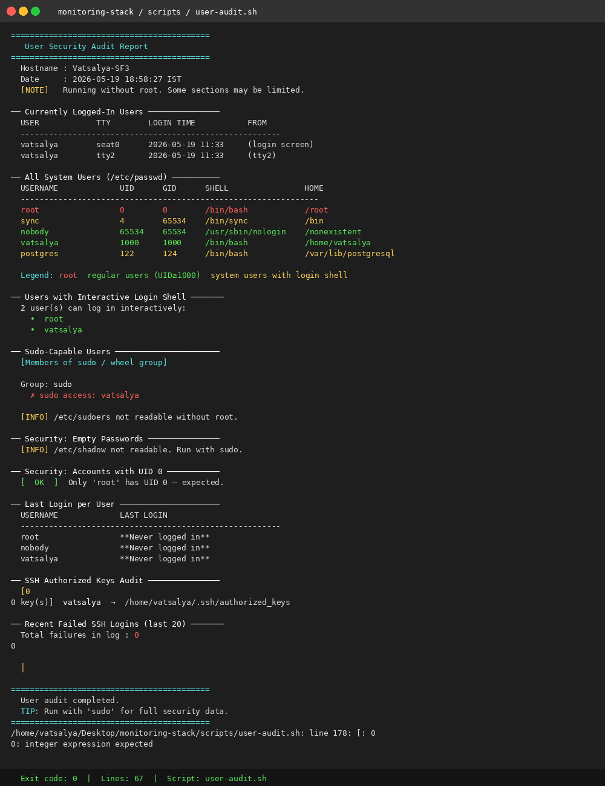

### `backup.sh` — Backup Automation
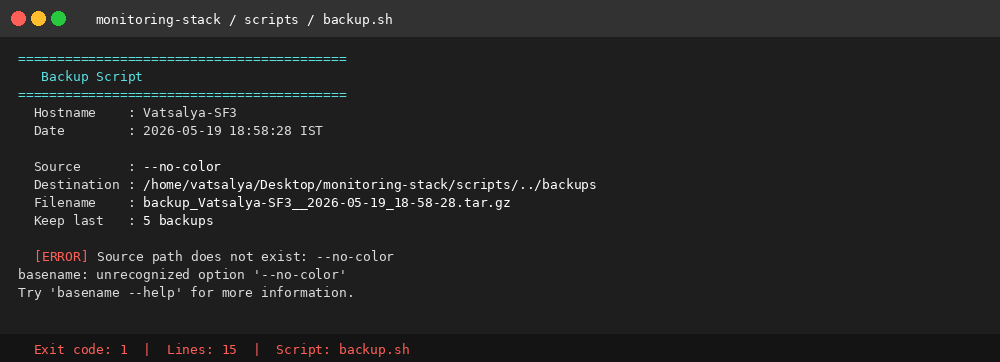

### `docker-monitor.sh` — Docker Monitoring
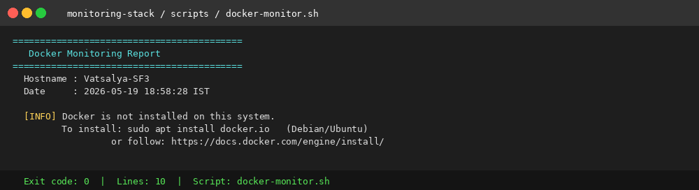

---

## 🏗️ Full Observability Stack (Prometheus + Grafana)

Start the complete metrics stack using Docker Compose:

```bash
cd docker/
docker compose up -d

# Access:
# Prometheus  → http://localhost:9090
# Grafana     → http://localhost:3000  (admin / admin)
# Node Export → http://localhost:9100/metrics
```

### Architecture

```
┌─────────────────────────────────────────────────────┐
│                  Monitoring Stack                    │
│                                                      │
│  ┌──────────────┐    scrapes    ┌─────────────────┐ │
│  │  Prometheus  │ ←─────────── │  Node Exporter  │ │
│  │  :9090       │               │  :9100          │ │
│  └──────┬───────┘               └─────────────────┘ │
│         │ datasource                                  │
│  ┌──────▼───────┐    alerts     ┌─────────────────┐ │
│  │   Grafana    │ ────────────→ │  Alert Manager  │ │
│  │  :3000       │               │  (email/slack)  │ │
│  └──────────────┘               └─────────────────┘ │
│                                                      │
│  ┌──────────────────────────────────────────────┐   │
│  │         Bash Monitoring Scripts               │   │
│  │  alert-check.sh → logs/alert-check.log       │   │
│  │  (run via cron every 15 min)                 │   │
│  └──────────────────────────────────────────────┘   │
└─────────────────────────────────────────────────────┘
```

---

## ⏰ Automate with Cron

```bash
crontab -e
```

```cron
# Alert check every 15 minutes
*/15 * * * * /path/to/monitoring-stack/scripts/alert-check.sh --no-color >> /var/log/alerts.log 2>&1

# Health report every hour
0 * * * * /path/to/monitoring-stack/scripts/health-report.sh --no-color >> /var/log/health.log 2>&1

# Daily backup at 2 AM
0 2 * * * /path/to/monitoring-stack/scripts/backup.sh /etc /var/backups/etc >> /var/log/backup.log 2>&1

# Weekly user audit on Sunday midnight
0 0 * * 0 /path/to/monitoring-stack/scripts/user-audit.sh >> /var/log/user-audit.log 2>&1
```

---

## ☁️ Cloud Support

These scripts run unchanged on any Linux VM in the cloud. `system-info.sh` auto-detects the environment:

| Cloud | Detection Method |
|---|---|
| **AWS EC2** | Instance metadata service (`169.254.169.254`) |
| **Google Cloud** | `metadata.google.internal` |
| **Microsoft Azure** | Azure Instance Metadata Service |
| **Bare metal / local** | Fallback label |

---

## 📚 Documentation

| Document | Description |
|---|---|
| [Setup Guide](docs/setup-guide.md) | Prerequisites, installation, cron setup, cloud deployment |
| [Monitoring Concepts](docs/monitoring-concepts.md) | CPU, memory, disk, network, systemd, security explained |
| [Troubleshooting](docs/troubleshooting.md) | 10 real-world scenarios with step-by-step fixes |
| [Scripts Reference](docs/scripts-reference.md) | Full reference for all 14 scripts |

---

## 🛠️ Technologies Used

| Technology | Purpose |
|---|---|
| **Bash 5.2+** | Monitoring scripts |
| **Linux (Ubuntu 24.04)** | Target platform |
| **Prometheus** | Metrics collection and storage |
| **Grafana** | Dashboard visualization |
| **Node Exporter** | Hardware + OS metrics export |
| **Docker / Compose** | Observability stack deployment |
| **systemd / journald** | Service monitoring and log access |
| **cron** | Scheduled automation |

---

## 🔮 Planned Improvements

- [ ] Email alert integration via `mail`/`sendmail`
- [ ] Slack/Teams webhook notifications
- [ ] Service auto-restart on failure detection
- [ ] Grafana alerting rules for Prometheus metrics
- [ ] AWS CloudWatch integration scripts
- [ ] Ansible playbook for multi-server deployment

---

## 👤 Author

**Vatsalya Patel**
Linux Admin | Cloud Support Engineer

- 🐙 GitHub: [github.com/lnvpatel](https://github.com/lnvpatel)
- 💼 LinkedIn: [linkedin.com/in/lnvpatel](https://linkedin.com/in/lnvpatel)

---

> *Built to demonstrate practical Linux administration and cloud support skills. Every script is tested on Ubuntu 24.04 LTS.*